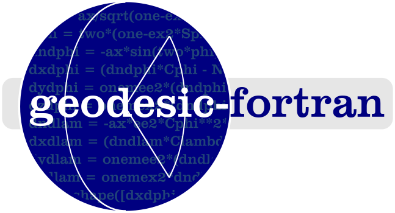

============

Implementation of geodesic routines in modern Fortran.

[](https://github.com/jacobwilliams/geodesic-fortran/releases/latest)
[](https://github.com/jacobwilliams/geodesic-fortran/actions)
[](https://codecov.io/gh/jacobwilliams/geodesic-fortran)

### Description

This is a library to solve geodesic problems on a planetary body (e.g., the Earth).

## Documentation

Some of the algorithms in this library:

| Procedure | Body Shape | Description | Reference
| --- | --- | --- | --- |
| [cartesian_to_geodetic_triaxial](https://jacobwilliams.github.io/geodesic-fortran/proc/cartesian_to_geodetic_triaxial.html) | Triaxial | Cartesian to geodetic | [Panou & Korakitis (2022)](https://link.springer.com/article/10.1007/s00190-022-01650-9)
| [cartesian_to_geodetic_triaxial_2](https://jacobwilliams.github.io/geodesic-fortran/proc/cartesian_to_geodetic_triaxial_2.html) | Triaxial | Cartesian to geodetic | [Bektas (2015)](https://www.arcjournals.org/international-journal-of-mining-science/volume-1-issue-1/4)
| [heikkinen](https://jacobwilliams.github.io/geodesic-fortran/proc/heikkinen.html) | Biaxial | Cartesian to geodetic | Heikkinen (1982)
| [olson](https://jacobwilliams.github.io/geodesic-fortran/proc/olson.html) | Biaxial | Cartesian to geodetic | [Olson (1996)](https://ieeexplore.ieee.org/document/481290)
| [direct](https://jacobwilliams.github.io/geodesic-fortran/proc/direct.html) | Biaxial | Direct geodesic problem | [Karney (2013)](https://link.springer.com/article/10.1007/s00190-012-0578-z)
| [direct_vincenty](https://jacobwilliams.github.io/geodesic-fortran/proc/direct_vincenty.html) | Biaxial | Direct geodesic problem | [Vincenty (1975)](https://www.ngs.noaa.gov/PUBS_LIB/inverse.pdf)
| [inverse](https://jacobwilliams.github.io/geodesic-fortran/proc/inverse.html) | Biaxial | Inverse geodesic problem | [Karney (2013)](https://link.springer.com/article/10.1007/s00190-012-0578-z)| []() | xxx | []()
| [inverse_vincenty](https://jacobwilliams.github.io/geodesic-fortran/proc/inverse_vincenty.html) | Biaxial | Inverse geodesic problem | [Vincenty (1975)](https://www.ngs.noaa.gov/PUBS_LIB/inverse.pdf)| []() | xxx | []()
| [great_circle_distance](https://jacobwilliams.github.io/geodesic-fortran/proc/great_circle_distance.html) | Sphere | Great circle distance | [Vincenty (1975)](https://www.ngs.noaa.gov/PUBS_LIB/inverse.pdf)| []() | xxx | []()


See the latest API documentation for the [full list](https://jacobwilliams.github.io/geodesic-fortran/). This was generated from the source code using [FORD](https://github.com/Fortran-FOSS-Programmers/ford) (i.e. by running `ford ford.md`).


## Compiling

A `fpm.toml` file is provided for compiling geodesic-fortran with the [Fortran Package Manager](https://github.com/fortran-lang/fpm). For example, to build:

```
fpm build --profile release
```

By default, the library is built with double precision (`real64`) real values. Explicitly specifying the real kind can be done using the following processor flags:

Preprocessor flag | Kind  | Number of bytes
----------------- | ----- | ---------------
`REAL32`  | `real(kind=real32)`  | 4
`REAL64`  | `real(kind=real64)`  | 8
`REAL128` | `real(kind=real128)` | 16

For example, to build a single precision version of the library, use:

```
fpm build --profile release --flag "-DREAL32"
```

To run the unit tests:

```
fpm test --profile release
```

To use `geodesic-fortran` within your fpm project, add the following to your `fpm.toml` file:
```toml
[dependencies]
geodesic-fortran = { git="https://github.com/jacobwilliams/geodesic-fortran.git" }
```

or, to use a specific version:
```toml
[dependencies]
geodesic-fortran = { git="https://github.com/jacobwilliams/geodesic-fortran.git", tag = "1.0.0"  }
```

### License

* This library is licensed under a permissive MIT/X11/BSD [license](https://github.com/jacobwilliams/geodesic-fortran/blob/master/LICENSE.txt).

### References

  * T. Vincenty, "[Direct and Inverse Solutions of Geodesics on the Ellipsoid with Application of Nested Equations](http://www.ngs.noaa.gov/PUBS_LIB/inverse.pdf)", Survey Review XXII. 176, April 1975.
* C. F. F. Karney,
  [Algorithms for geodesics](https://doi.org/10.1007/s00190-012-0578-z),
  J. Geodesy 87(1), 43–55 (2013);
  [Addenda](https://geographiclib.sourceforge.io/geod-addenda.html).
* G. Panou and R. Korakitis, "[Cartesian to geodetic coordinates conversion
  on an ellipsoid using the bisection method](https://link.springer.com/article/10.1007/s00190-022-01650-9)". Journal of Geodesy volume 96, Article number: 66 (2022).
* Gema Maria Diaz-Toca, Leandro Marin, Ioana Necula, "[Direct transformation from Cartesian into geodetic coordinates on a triaxial ellipsoid](https://www.sciencedirect.com/science/article/pii/S0098300420305410?via%3Dihub)", Computers & Geosciences, Volume 142, September 2020, 104551.

## Other links:

* `Geographiclib` [documentation](https://geographiclib.sourceforge.io/Fortran/doc) and [git repository](https://github.com/geographiclib/geographiclib-fortran)
* [Fortran Astrodynamics Toolkit](https://github.com/jacobwilliams/geodesic-fortran)
* FORWARD and INVERSE from the [NGS](http://www.ngs.noaa.gov/PC_PROD/Inv_Fwd/)

